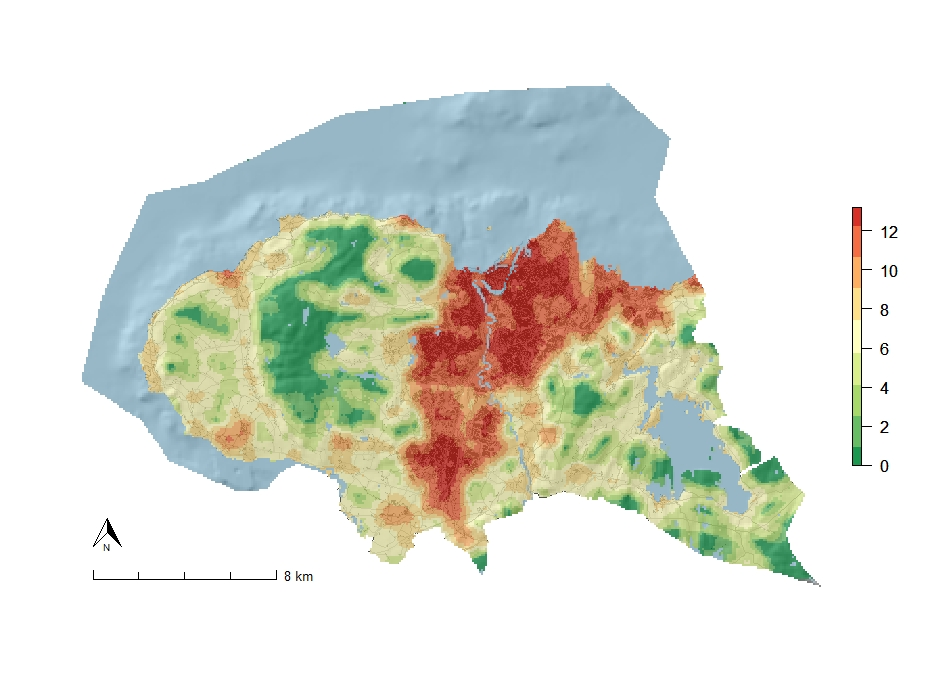

<br/><br/>

### Background

The complex landscape gradient ‘land use intensity’ was identified in the ordination analyses as a main gradient within all major types, except within coastal plains. 
The GIS-based proxy for this gradient was obtained as the sum of three indices, quantified and weighted in order to project the results from the statistical analyses. The index consisted of two components:  

1. a building component (ByI), and 
2. a component (KfI) that indicates the occurrence of artificial surfaces such as built up and constructed areas. 

Agricultural land use such as cultivation is not included, as this was identified as an independent gradient. Extensive human land use related to e.g. grazing, reindeer husbandry, forestry and other indirect ecological disturbances, are not included in the gradient, due to lack of data. 
<br/><br/>

Building component (Byl)                                  | Data source
----------------------------------------------------------| -----------
Buildings (of any kind)	                                  | GAB
Linear elements from N50 ‘constructions’ (power lines)    | N50
Linear elements from N50 ‘transportation’* 		  | N50

<br/>

Land cover component (Kfl), i.e. land cover classes:      | Data source
----------------------------------------------------------| -----------
Urban fabric 	                                            | N50
Industrial areas	                                        | N50
Airports	                                                | N50
Mine, dump and construction sites	                        | N50
Graveyards	                                              | N50
Sport and leisure facilities                              | N50
*_roads and railways are included, but minor trails,tractor trails and paths are not included_  
**_including golf courses, ski jump facilities, Sport and leisure facilities, ski resorts, etc._ 

<br/><br/>
Both components (buildings and infrastructure/built up areas) are calculated as frequencies of raster grid cells registered in a standard raster of 81 grid cells, each 100 × 100 m, in a circular neighborhood with radius 500 m.  The formulae for calculation of the index is given as a raster calculation by the formulae:   

<br/><br/>

$Ifl = 2 · log_2 (4+Byl) + log_2(4+Kfl) -3·log_2 4$  
<br/><br/>

where Ifl is the raster containing the values for the building component of the index, and Kfl is the raster containing the land cover part of the index. The formulae can be expressed in a shorter version as:  

<br/><br/>
$Ifl = 2 · log_2(4+Byl) + log_2(4+Kfl) -6$  
<br/><br/>

### Calculation of land use intensity in R

Here we illustrate how the land use intensity index can be calculated from raw data, with Trondheim municipality as an example. The index can be calculated with standard GIS-operations available in any GIS-program (e.g. Q-gis, ArcGis, etc.). Here we illustrate the calculations with the program R (ref). 


To calculate the land use intensity in R, we load the neccecary packages for geocomputation and raster calculations. Library ‘raster’ provide tools and functions to manipulate geographic (spatial) data in raster format. LIbbrary rgdal provide access to projection/transformation operations. Library ‘sf’ has tools for spatial geometry of objects, while ‘mapview’ is used for interactive viewing of spatial data. The two libraries ‘RColorBrewer’ and ‘prettymapr’ is used for cartography.
```{r, results = "hide", message=FALSE}

library(raster) 
library(rgdal) 
library(sf) 
library(mapview) 
library(RColorBrewer) 
library(prettymapr) 
```
<br/>

### Data aquisition and preparations

The data we apply in this tutorial can be downloaded for any Norwegian municipality from https://www.geonorge.no/
We downloaded the N50-data and data from the GAB-register in ESRI file-geodatabase-format, stored in separate folders. 

```{r, include=FALSE}
### Preparations
rm(list=ls()) ### remove data frames and object from part I
memory.limit(size=357500) #increasing memory limit for faster processing
setwd("~/GIS_Trond/Land_Use_Intensity/land_use_intensity")

```
In addition we used a digital elevation model with resolution 100m as a basis for all calculations. All calculations are executed within the cell size from the 100m raster. We used a 100m dem covering the whole norwegian mainland. We load the dem from the working directory (remeber to set working directory with e.g. "setwd"). We then check the extent of the dem. 

```{r}
getwd()
```


```{r, results = "hide"}
dem <- raster("dem.tif") 
```
<br/>
We read in data from N50-data from ESRI geodatabase at the given directory with functions from the ‘rgdal’-package, and look at the basic information about the geodatabase.  
```{r, results = "hide"}
### N50 DATA
fgdb <- "C:/Users/trosim/Documents/GIS_Trond/Land_Use_Intensity/Basisdata_5001_Trondheim_25833_N50Kartdata_FGDB.gdb"
subset(ogrDrivers(), grepl("GDB", name))
```

We then check which features that are in this file-geodatabase.
```{r}
fc_list <- ogrListLayers(fgdb)
print(fc_list)
```
<br/>
We begin with reading in the municipality border, as this is the definitions of our target area. 
```{r, results = "hide"}
n50_adm_area <- readOGR(dsn=fgdb,layer= "N50_AdministrativeOmråder_omrade")  
```
<br/>
We then clip the DEM to the same extent as the target area (Trondheim municipality). We plot the raster and the administration area, to check that the data is right. 
```{r}
e <- extent(n50_adm_area)
dem_trd <- crop(dem, e) # making a new raster; the cropped dem
plot(dem_trd)
plot(n50_adm_area, add=TRUE)
```

### Preparing raster data for calculations

The next step is to prepare the rasters we use for calculations. All vector data (points, lines and polygons must be converted to raster data. 
To do our calculations we need raster data with the presence and absence of: a) all types of buildings and infrastucture; and b) land cover types showing presence and absence of built up areas. In addition, we will need some rasters that are used to eliminate areas we do not use in our calculations (e.g. water bodies, etc.).

We rasterize the target area, setting the raster value to 1 and the background (areas outside Trondheim municipality) to ‘NA’ (no data).
```{r, results = "hide"}
target_area <- rasterize(n50_adm_area, dem_trd, field = 1, background=NA)
```
<br/>
We read in the water bodies. These are subsets of the layer AR50 land cover (arealdekke). 
```{r}
n50_lc_a <- readOGR(dsn=fgdb,layer= "N50_Arealdekke_omrade")  
unique(n50_lc_a$objtype) # checking which object types are included.
```
<br/>
We selct (subset) the water bodies and store them as a separate object.We then combie the background raster (areas outside Trondheim municipality) and water bodies to produce a NA-raster with the values 1 and NA used for subsequent calculations.We reclassify by assigning the raster values in the ranges 0-0., 0.1-100 to take values 1 and NA respectively.

```{r,results="hide"}
n50_lc_water <- n50_lc_a [n50_lc_a$objtype== "ElvBekk" | 
                                          n50_lc_a$objtype== "Havflate" | 
                                          n50_lc_a$objtype== "Innsjø" | 
                                          n50_lc_a$objtype== "InnsjøRegulert" ,]

na_raster <- rasterize(n50_lc_water, dem_trd, field = 5, background=1)
na_raster <- na_raster*target_area

# Reclassify

rcl <- matrix(c(0, 2, 1, 2, 100, NA), ncol = 3, byrow = TRUE)
na_raster <-  reclassify(na_raster, rcl = rcl)
```
<br/><br/>

### Calculating the building component of the index

The next step is to read in and rasterize data about buildings.

| Objects                                                    | Data source
| ---------------------------------------------------------- | -----------
| - Buildings (of any kind)	                                 | GAB
| - Linear elements from N50 ‘constructions’ (power lines)   | N50
| - Linear elements from N50 ‘transportation’* 		           | N50
*_roads and railways are included, but minor trails,tractor trails and paths are not included_  
 
```{r, results="hide"}

### Building building data from Matrikkelen (GAB)
fgdb <- "C:/Users/trosim/Documents/GIS_Trond/Land_Use_Intensity/Basisdata_5001_Trondheim_25833_MatrikkelenBygning_FGDB.gdb"
# List all feature classes in a file geodatabase
subset(ogrDrivers(), grepl("GDB", name)) 
fc_list <- ogrListLayers(fgdb)
print(fc_list) 
building_GAB <- readOGR(dsn=fgdb,layer= "matrikkelenbygning_bygning")
```
<br/>
Point data to the left, raster data to the right:
```{r}
plot(na_raster, legend= FALSE,)
plot(building_GAB, pch=18, cex= 0.1, col = "red", add=TRUE, legend= FALSE)
```
<br/><br/>
We rasterize the data and check the result. 
```{r}
byl_buildings <- rasterize(building_GAB, dem_trd, field = 1, background=0)
plot(byl_buildings, legend= FALSE)
```
<br/>
We read in other buildings (facilities) not included in GAB from from N50. These are technical infrastructure (roads, railways power lines, sports facilities, etc.). We rasterize these objets also, And combine them to produce a presence/absence raster of all buildings and facilities combined. 
```{r, results="hide"}
# The input file geodatabase
fgdb <- "C:/Users/trosim/Documents/GIS_Trond/Land_Use_Intensity/Basisdata_5001_Trondheim_25833_N50Kartdata_FGDB.gdb"

#Facilities - points
n50_buildings_facilities_position <- readOGR(dsn=fgdb,layer= "N50_BygningerOgAnlegg_posisjon") 
#unique(n50_buildings_facilities_position$objtype)

n50_facilities <- n50_buildings_facilities_position [n50_buildings_facilities_position$objtype== "Hoppbakke" | 
                                                n50_buildings_facilities_position$objtype== "MastTele" |
                                                n50_buildings_facilities_position$objtype== "SpesiellDetalj" | 
                                                n50_buildings_facilities_position$objtype== "Tank" | 
                                                n50_buildings_facilities_position$objtype== "TÃ¥rn" | 
                                                n50_buildings_facilities_position$objtype== "Vindkraftverk" ,]
```
<br/>
Subsequently, we read in transportation line data.
```{r, results="hide"}
# roads
n50_transport <- readOGR(dsn=fgdb,layer= "N50_Samferdsel_senterlinje")  
# railroads
veg_bane <- n50_transport [n50_transport$objtype== "Bane" | n50_transport$objtype== "VegSenterlinje" ,]
# Facilities - lines (e.g. power lines)
n50_buildings_facilities_position_cl <- readOGR(dsn=fgdb,layer= "N50_BygningerOgAnlegg_senterlinje") 
# Power lines
falilities_lines <- n50_buildings_facilities_position_cl [n50_buildings_facilities_position_cl$objtype== "LuftledningLH",]
```
<br/>
All layers are rasterized and combined by raster calculations, followed by reclassification.
```{r, results="hide"}
# Rasterize all these layers:
byl_facilities <- rasterize(n50_facilities, dem_trd, field = 1, background=0)
byl_transport <- rasterize(veg_bane, dem_trd, field = 1, background=0)
byl_facilities_lines <- rasterize(falilities_lines, dem_trd, field = 1, background=0)

# Adding rasters
byl_raw <- byl_buildings + byl_facilities + byl_transport + byl_facilities_lines

# Reclassify
# Here, we assign the raster values in the ranges 0-0., 0.1-100 
# are reclassified to take values 0 and 1 respectively.
rcl <- matrix(c(0, 0.1, 0, 0.1, 100, 1), ncol = 3, byrow = TRUE)
byl_raw_recl = reclassify(byl_raw, rcl = rcl)
byl_corrected <- byl_raw_recl*na_raster
```
<br/>
The result of this code lines is a presence/absence-raster showing 100m cells for cells with or without buildings and infrastructure.
```{r}
plot(byl_corrected)
```
<br/><br/>

### Calculating Kfl, the land cover component of the index

Land cover component (Kfl), i.e. land cover classes:      | Data source
----------------------------------------------------------| -----------
Built up areas, i.e.:	                                    | N50
Urban fabric 	                                            | N50
Industrial areas	                                        | N50
Airports	                                                | N50
Mine, dump and construction sites	                        | N50
Graveyards	                                              | N50
Sport and leisure facilities*                             | N50

*_including golf courses, ski jump facilities, Sport and leisure facilities, ski resorts, etc._ 

We repeat the procedure for land cover data. Reading in spatial data, subset the data we are interested in, rasterize this data, reclassify and combine them. 
```{r, results="hide"}
#Built up areas as landcover
n50_lc_a <- readOGR(dsn=fgdb,layer= "N50_Arealdekke_omrade")  
#unique(n50_lc_a$objtype)
n50_lc_build_up_area <- n50_lc_a [n50_lc_a$objtype== "Alpinbakke" | 
                                        n50_lc_a$objtype== "BymessigBebyggelse" | 
                                        n50_lc_a$objtype== "Gravplass" | 
                                        n50_lc_a$objtype== "Golfbane" | 
                                        n50_lc_a$objtype== "Industriområde" | 
                                        n50_lc_a$objtype== "SportIdrettPlass" | 
                                        n50_lc_a$objtype== "Steinbrudd" | 
                                        n50_lc_a$objtype== "Tettbebyggelse" ,]

#Rasterize
kfl_built_up_area <- rasterize(n50_lc_build_up_area, dem_trd, field = 1, background=0)

#Built up areas from buildings and facilities dataset (not buildings/facilities that are already inclued in byl)
#unique(n50_buildings_facilities_position$objtype)
n50_lc_build_up_areas_2 <- n50_buildings_facilities_position [n50_buildings_facilities_position$objtype== "Campingplass" | 
                                                n50_buildings_facilities_position$objtype== "Parkeringsområde" ,]

kfl_built_up_areas_2 <- rasterize(n50_lc_build_up_areas_2, dem_trd, field = 1, background=0)

# Combine
kfl_raw <- kfl_built_up_area + kfl_built_up_areas_2

# Reclassify
kfl_raw_recl = reclassify(kfl_raw, rcl = rcl)

# Masking out NA-areas 
kfl_corrected <- kfl_raw*na_raster
```
<br/>
The result is a presence/absence-raster with land-cover clases consisting of built up areas. 
```{r, echo=FALSE}
plot(kfl_corrected)
```
<br/><br/>

### Calculating focal statistics

Based on our two presence/absence rasters of builings and built up land-cover-classes, we calculate focal statistics with a moving window-function. This means that for each cell, we calculate number of cells in the neighbourhood within a circle with radius 500 m with presence of builings and infrastucture and built-up landcover respectively. The result is two raster showing not only presence/absence of these landscape elements, but also their density within the various areas. 

```{r}
# Calculating focal statistics
fwModel <- focalWeight(byl_corrected, 500, type='circle')
fwModel[fwModel>0] <- 1
byl_focal<-focal(byl_corrected, w=fwModel ,fun=sum , na.rm=TRUE)
```
Note the following code line.
```{r, results="hide"}
fwModel[fwModel>0] <- 1
```
If we discard this line, the focal statistics will be calculated as a frequency on a 0-1 scale (number of cells with presence/total number of cells in the neighbourhood), instead of as total number of cells. However, we are going to do this correction later, and include the line in the code above.  
The focal raster looks like this.
<br/><br/>
```{r, echo=FALSE}
plot(byl_focal)
```
<br/><br/>
We now need to correct for edge effects related to neighbourhood-calculations in areas next to NA-areas (no data). We therefore calculate a raster with showing number of cells with data in the neighbourhood of each cell. Most cells have 81 cells with data in their neighboourhood, but cells near borders, water bodies, etc have fewer  cells with data values. This raster is produce with the solely purpose of correcting for edge effects. 
```{r}
# Calculating correction raster 
fwModel <- focalWeight(na_raster, 500, type='circle')
fwModel[fwModel>0] <- 1
na_focal<-focal(na_raster, w=fwModel ,fun=sum , na.rm=TRUE)
```
<br/>
We then divide the raster with the result of the focal calculation with the number of cells in the neighbourhood of each cell. We also multiply with the NA-raster to subreact NA-areas(water bodies, etc). The result is a raster showing frequency of cells on a 0-1 scale (below to the right), as opposed to a map without correction for edge effects (below to the left). 
```{r, echo=FALSE}
byl <- byl_focal/na_focal
byl <- byl*na_raster
plot(byl)
```

We repeat the procedure for the land-cover component of the index.
```{r}
# Calculating focal statistics
fwModel <- focalWeight(kfl_corrected, 500, type='circle')
fwModel[fwModel>0] <- 1
kfl_focal<-focal(kfl_corrected, w=fwModel ,fun=sum , na.rm=TRUE)
fwModel[fwModel>0] <- 1
kfl <- kfl_focal/na_focal
kfl <- kfl*na_raster
```
<br/><br/>

### Combining Byl and Kfl to the land use intensity index

We now have two rasters, one for each component of the land use intensity index. We cobine the two rasters with the formulae for the Land-use intensity-index:
<br/><br/>

$Ifl = 2 · log_2(4+Byl) + log_2(4+Kfl) -6$
<br/><br/>
This is done by a simple raster calculation. As we can se, the result is a raster with values from 0-13.2
```{r}
ABI <- 2*log2(4+81*byl)+log2(4+81*kfl)-6
ABI
```
<br/>
Let us look at the distribution of values in the terrestrial areas of Trondheim municipality.
```{r}
hist(ABI,
     main = "Land use intensity",
     xlab = "Land use indtensity index", ylab = "Frequency",
     col = "springgreen")
```
<br/>
The resulting raster can be exported as e.g. a geo-tif. 
```{r}
plot(ABI, col = rev(brewer.pal(9, "RdYlGn")), box = F, axes = F, legend = T)
ABI <- ABI*na_raster
```
<br/>
We can plot the index with a more advanced cartography.
```{r, echo=FALSE, cache=TRUE, warnings=FALSE, message = FALSE}
#Fancy plot

# Calculate slope:
slope <- terrain(dem_trd, opt="slope")

# Calculate aspect
aspect <- terrain(dem_trd, opt = "aspect")

# Calculate hillshade
hillshade <- hillShade(slope, aspect, 30, 315)

n50_lc_water <- n50_lc_a [n50_lc_a$objtype== "ElvBekk" | 
                                          n50_lc_a$objtype== "Havflate" | 
                                          n50_lc_a$objtype== "Innsjø" | 
                                          n50_lc_a$objtype== "InnsjøRegulert" ,]

na_raster <- rasterize(n50_lc_water, dem_trd, field = 5, background=1)
na_raster <- na_raster*target_area
# Reclassify
# Here, we assign the raster values in the ranges 0-0., 0.1-100 
# are reclassified to take values 1 and NA respectively.
rcl <- matrix(c(0, 2, 1, 2, 100, NA), ncol = 3, byrow = TRUE)
na_raster <-  reclassify(na_raster, rcl = rcl)
```


```{r, echo=FALSE, cache=TRUE, warnings=FALSE, message = FALSE}
#Complex cartography
water_raster <- rasterize(n50_lc_water, dem_trd, field = 1, background=NA)
hillshade <- hillshade*target_area

plot(hillshade, col=grey(0:100/100), box = F, legend=FALSE, axes=F)
plot(n50_buildings_facilities_position_cl, col= "grey31", add=TRUE)
plot(veg_bane, col= "grey31", add=TRUE)
plot(building_GAB, pch=18, cex= 0.1, col = "grey0", add=TRUE)
plot(water_raster, col = rev(brewer.pal(1, "Blues")), box = F, axes = F, legend = F, alpha=.7, add=T)
plot(ABI, col = rev(brewer.pal(9, "RdYlGn")), box = F, axes = F, legend = T, alpha=.7, add=T)
plot(ABI, legend.only = T, add = T, col = rev(brewer.pal(9, "RdYlGn")))
addnortharrow(pos="bottomleft", padin = c(0.15, 0.45), scale=0.5)
addscalebar(plotunit = "m", widthhint = 0.25,
            unitcategory = "metric", htin = 0.1, padin = c(0.15, 0.15),
            style = "ticks", bar.cols = c("black", "white"), lwd = 1,
            linecol = "black", tick.cex = 0.7, labelpadin = 0.08, label.cex = 0.8,
            label.col = "black", pos = "bottomleft")

```


