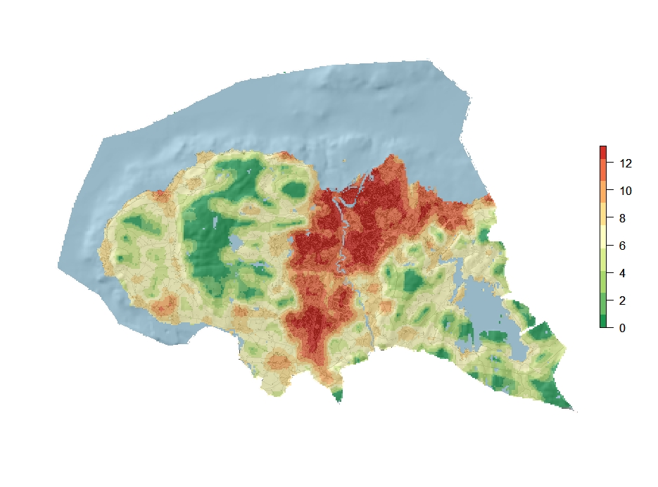

# Background
The complex landscape gradient ‘land use intensity’ was identified in the ordination analyses as a main gradient within all major types, except within coastal plains. 
The GIS-based proxy for this gradient was obtained as the sum of three indices, quantified and weighted in order to project the results from the statistical analyses. The index consisted of two components:  

1. a building component (ByI), and 
2. a component (KfI) that indicates the occurrence of artificial surfaces such as built up and constructed areas. 

Agricultural land use such as cultivation is not included, as this was identified as an independent gradient. Extensive human land use related to e.g. grazing, reindeer husbandry, forestry and other indirect ecological disturbances, are not included in the gradient, due to lack of data. 

